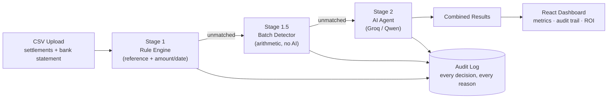

# LedgerLens — AI Reconciliation Controller

**Razorpay Hackathon · Track 4: AI Finance Controller**

An explainable, three-stage reconciliation pipeline that matches payment
settlements against a bank statement, and a live dashboard that shows every
decision, its confidence, and its business impact.

---

## The problem

A finance team ends the month with two lists that are supposed to agree:

| The gateway says it paid out | What the bank actually shows |
| --- | --- |
| `settlements.csv` | `bank_statement.csv` |

They never line up cleanly:

- **MDR (Merchant Discount Rate) + GST** — the bank credit is short by the
  platform's fee plus GST on that fee
- **Settlement lag** — under a **T+2 settlement cycle**, money lands 1–3 days
  after the settlement date, sometimes later around bank holidays
- **Garbled references** — bank narration truncates `ORD-7049` to `ORD-70`
- **Batched payouts** — one **nodal account** credit covers three separate
  settlements bundled together
- **Ambiguity** — two orders, same amount, same day, indistinguishable by rule
- **Genuinely missing money** — a settlement whose credit never arrived

Rule-based matching resolves the clean cases and then quietly guesses at the
rest. Someone reconciles the remainder by hand — often for hours, every day.

## The approach



Three stages, deliberately in this order:

1. **Deterministic rules first.** Exact reference and amount+date matches are
   cheap, instant and provably correct. No reason to spend an AI call on them.
2. **Arithmetic batch detection.** Pure math checks whether 2–3 unmatched
   settlements, net of MDR + GST, sum to one unclaimed bank credit — no AI
   needed for this either.
3. **AI agent for the residue.** Only what's left after stages 1 and 1.5
   escalates. The agent reasons about fee deltas, date windows, mangled
   references, and returns a match, a confidence score, and a written
   justification.

Every decision — rule, batch, or agent — is written to an audit log and shown
in the dashboard's **Audit Trail** tab.

## Reported metrics

| Metric | Meaning |
| --- | --- |
| Match rate | Share of settlements assigned to a bank line |
| Accuracy | Share of those assignments that are correct, vs. ground truth |
| Exceptions | Flagged for human review rather than auto-resolved |
| Throughput | Records processed per second |

Rules alone establish the baseline (75%). The batch detector and AI agent's
combined contribution lifts that to 92.2% — visualised live in the dashboard's
**Pipeline Accuracy Progression** chart.

## Dataset

`engine/generate_data.py` builds the batch from a fixed seed, so every run is
reproducible.

| Category | Count | What it tests |
| --- | --- | --- |
| CLEAN | 24 | Baseline — rules should get all of these |
| FEE | 12 | Amount differs by MDR + GST |
| LAG | 8 | Fee *and* a 1–3 day T+2 delay |
| GARBLED | 6 | Reference partially destroyed |
| BATCH | 6 | Three settlements, one nodal account credit |
| AMBIGUOUS | 4 | Identical amount and date |
| MISSING | 4 | Correct answer is "no match" |
| ORPHAN | 3 | Bank credits that aren't settlements at all |

`data/ground_truth.csv` holds the answer key and is used only for scoring —
never read by the matcher.

## Dashboard features

Beyond the core pipeline, the React dashboard adds:

- **Audit Trail** — every decision in order, with stage, strategy, confidence,
  and reason
- **Confidence Distribution Chart** — how certain the pipeline was across all
  decisions, bucketed
- **Near-miss suggestions** — every exception shows the closest bank entry
  that almost matched, and what a reviewer should check
- **Adjustable parameters** — live sliders for MDR rate, date window, and
  confidence threshold, with instant re-run
- **Pipeline Accuracy Progression** — animated chart showing match rate climb
  stage by stage
- **Business Impact Calculator** — translates this run's measured throughput
  into hours and cost saved per month at any volume
- **Export** — full report as `.txt`, matches and exceptions as `.csv`

## Running it

**Generate data:**
```bash
python engine/generate_data.py
```

**Run the pipeline from the CLI:**
```bash
python engine/run_full.py
```

**Run the full stack:**
```bash
# Terminal 1 — API
uvicorn api.main:app --reload --port 8000

# Terminal 2 — Dashboard
cd frontend
npm run dev
```

Then open `http://localhost:5173`, upload `data/settlements.csv` and
`data/bank_statement.csv`, and click Run Reconciliation.

Requires a `.env` file at the project root with `GROQ_API_KEY=<your key>`
(never commit this file — it's gitignored).

## Tests

```bash
pip install pytest
python -m pytest tests/ -v
```

14 tests cover the deterministic stages: reference matching, amount+date
matching with a configurable date window, MDR/GST fee math, batch detection
across multiple settlements, and the ground-truth scoring function.

## Scale testing

`engine/scale_test.py` replicates the base dataset across additional months
of business (not more transactions crammed into the same days) and times
Stage 1 + Stage 1.5 against the larger set:

```bash
python engine/scale_test.py 16   # ~1,000 records
```

| Settlements | Time | Throughput |
| --- | --- | --- |
| 256 | 0.22s | 1,164 rec/s |
| 1,024 | 1.9s | 539 rec/s |
| 3,200 | 16.0s | 199 rec/s |

This surfaced a real bug during development: the batch detector's combination
search over unmatched settlements was originally O(n³) across the *entire*
unmatched pool, which hung past two minutes at 1,000+ records. Since a batch
can only ever combine settlements sharing the same `settlement_date`, the fix
groups settlements by date *before* generating combinations — bounding each
search to a single day's volume instead of the whole dataset. The numbers
above are measured after that fix. The AI stage (Stage 2) is intentionally
excluded from this test — see Limitations below.

## Limitations & next steps

Built and tested against a synthetic dataset of 64 settlements. Being upfront
about what it doesn't do yet:

- **Synthetic data only.** Real bank statement formats vary widely between
  banks — column names, date formats, and narration conventions all differ.
  The parser would need per-bank adapters for production use.
- **No persistent storage.** Results live in memory on the API server and are
  lost on restart. A real deployment needs a database for the audit log and
  historical runs.
- **Single currency.** No FX handling for international settlements.
- **Not integrated with Razorpay's actual Settlement API.** This reads CSV
  exports; a production version would consume settlement data directly via
  API/webhook.
- **AI agent calls are sequential.** For very high volumes, batching or
  parallelising the AI stage would meaningfully improve throughput.

Given more time, the natural next steps are: Postgres-backed audit history,
multi-tenant support (one dashboard, many merchants), and webhook-triggered
reconciliation instead of manual CSV upload.

## Status

- [x] Synthetic data generator with planted, categorised failure modes
- [x] Rule-based matcher (baseline — 75% accuracy)
- [x] Arithmetic batch detector (Stage 1.5)
- [x] AI agent for unmatched residue (Stage 2 — 92.2% accuracy)
- [x] Metrics + full audit trail
- [x] FastAPI service
- [x] React dashboard with 7 enhancement features (incl. Business Impact Calculator)
- [x] Failure-tested (empty file, bad columns, API offline)
- [x] Unit tests for the deterministic stages (14 tests, `tests/`)
- [x] Scale-tested to 3,200 records; fixed a real O(n³) bottleneck found in the process
